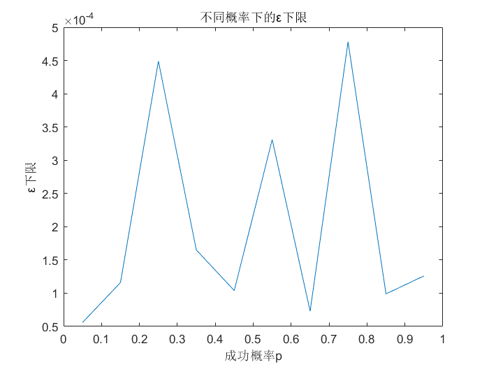
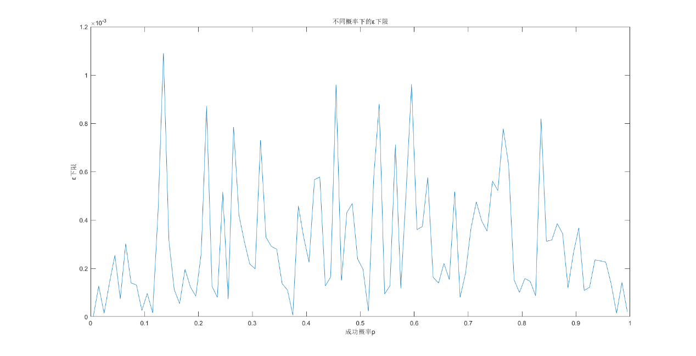
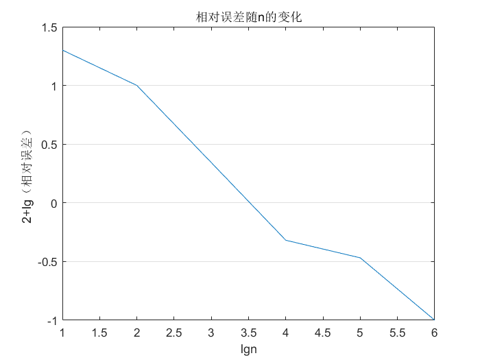
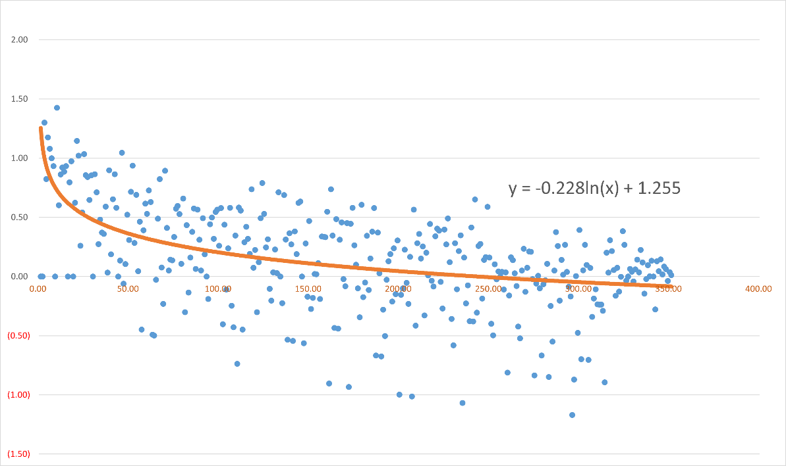

{width="3.2708333333333335in"
height="0.8020833333333334in"}

SHANGHAI JIAO TONG UNIVERSITY

**概率论和数理统计**

PROBABILITY THEORY AND MATHEMATICAL STATISTICS

**大作业**

MAJOR ASSINGMENT

**[基于计算机模拟实验的伯努利]{.underline}**

**[大数定律适用性分析]{.underline}**

20xx年xx月

学生姓名:

学生学号:

专 业:

教 师:

**摘要**

伯努利大数定律给出了一个普遍结论：大量的重复试验会使结果趋于稳定。具体而言，当$N$足够大时，随机事件A发生的频率$N_{A}/N$依概率收敛于A在一次试验中发生的概率$p$。本作业将先对伯努利大数定律进行基本的理解与阐释，并通过计算机模拟实验先进行上述定律的验证，再通过不同的$N$取值并计算对给定$\varepsilon$的概率，来确定一个最经济并最适合的用于估算的事件发生概率的$N$的取值，最后给出了一些简便的大数定律在数理统计、管理决策等方面的应用，为某些生产活动做出指导，当然最主要是为了完成我的大作业。

在第一章会给出基本概念和理解，以及实际生活中无法解决的问题；在第二章会先进行验证，然后给出一个可以实现的近似估计，来解决实际生活中无法达到正无穷的问题；在第三章，会以第二章给出的估计条件为基础，来为不同场景下n的取值的适用性做出分析；在第四章，会给出一些使用的例子。

**关键词** 伯努利大数定律；独立重复试验；适用范围估计

目录

[一、 伯努利大数定律 [4](#伯努利大数定律)](#伯努利大数定律)

[二、 用计算机模拟实验进行验证
[5](#用计算机模拟实验进行验证)](#用计算机模拟实验进行验证)

[1、方法 [5](#方法)](#方法)

[2、实验结果 [5](#实验结果)](#实验结果)

[3、解决无穷的方法 [7](#解决无穷的方法)](#解决无穷的方法)

[三、 在实际问题中的适用性分析
[8](#在实际问题中的适用性分析)](#在实际问题中的适用性分析)

[1、方法 [8](#方法-1)](#方法-1)

[2、实验结果 [8](#实验结果-1)](#实验结果-1)

[3、实际使用适用性 [10](#实际使用适用性)](#实际使用适用性)

[四、 伯努利大数定律的应用
[11](#伯努利大数定律的应用)](#伯努利大数定律的应用)

# 伯努利大数定律

伯努利大数定律是概率论中的一个重要定律，它描述了随机事件重复独立进行多次时，事件出现的频率会依概率收敛于该事件发生的概率的规律。具体来说，伯努利大数定律可以简述为：在一系列独立重复的随机试验中，如果事件A的概率为p，则当试验次数n趋近于无穷大时，事件A发生的频率n_A/n趋近于p。

用符号表述为:

$$\begin{array}{r}
\forall\varepsilon > 0\ ,\ \lim_{n \rightarrow + \infty}{P\left( \left| \frac{n_{A\ }}{n} - p \right| \geq \varepsilon \right) = 0}\ \ or\ \lim_{n \rightarrow + \infty}{P\left( \left| \frac{n_{A\ }}{n} - p \right| < \varepsilon \right) = 1}\#\left( \text{1-1} \right)
\end{array}$$

伯努利大数定律是概率论中非常基础且广泛应用的一个定律，它在科学研究，如在统计学、保险学、金融学、物理学、生命科学等领域都有广泛的应用。

Bernoulli早在 1713
年就已经发现该定理的结论,他观察到当大量重复某一试验时，随着试验次数越来越多,某个随机事件的频率会稳定于该随机事件的概率。为了纪念他所做的贡献，该结果称为Bernoulli大数定律.而且他成功地通过数学语言将现实生活中这种现象表示出来，赋予其确切的数学含义，让人们对于这一类问题有了新的认识和深刻的理解，为后来研究大数定律问题奠定了基础除Bernoulli之外，还有很多数学家为大数定律的发展做出了重要的贡献，像Laplace(拉普拉斯)、Lyapunov(李雅普诺夫)、Lindeberg(林德伯格)、Feller(费勒)、Chebyshev(切比雪夫)、Khintchine(辛钦)等他们对于大数定律乃至概率论的进步所起的作用都是不可估量的。[^1]

在实际生产中，n趋于正无穷是不可能做到的，因此，需要确定可以实际验证的个数，来确定一个伯努利大数定律的估计，来使得实际使用伯努利大数定律时有足够的准确性。

# 用计算机模拟实验进行验证

## 方法

1.  给定一次随机试验中事件A发生的概率（即成功概率）

2.  用计算机模拟100000次随机试验，统计成功次数

3.  代入公式(1-1)验证

4.  选取另外9个成功概率，重复1-3

## 实验结果

下面的表格给出了10组不同成功概率在1000000次试验中的成功频率：

------------ ------------ ------------ ------------ ------------- ------------
  成功概率     试验次数     成功次数     成功频率     绝对误差      $$u_{rx}$$

  0.05         1000000      49944        0.049944     -0.00006      0.11%

  0.15         1000000      149884       0.149884     -0.000116     0.08%

  0.25         1000000      249551       0.249551     -0.000449     0.18%

  0.35         1000000      349835       0.349835     -0.000165     0.05%

  0.45         1000000      449896       0.449896     -0.000104     0.02%

  0.55         1000000      550331       0.550331     0.000331      -0.06%

  0.65         1000000      649927       0.649927     -7.3E-05      0.01%

  0.75         1000000      749522       0.749522     -0.000478     0.06%

  0.85         1000000      849901       0.849901     -9.9E-05      0.01%

  0.95         1000000      949874       0.949874     -0.000126     0.01%
------------ ------------ ------------ ------------ ------------- ------------

  : 表格 1 2-1

表格中，成功频率计算公式为

$$\begin{array}{r}
\frac{n_{A}}{n}\#\left( \text{2-1} \right)
\end{array}$$

绝对误差计算公式为

$$\begin{array}{r}
\frac{n_{A}}{n} - p\#\left( \text{2-2} \right)
\end{array}$$

定义相对误差为$u_{rx}$，$u_{rx}$计算公式为

$$\begin{array}{r}
\left( 1 - \frac{\frac{n_{A}}{n}}{p} \right) \times 100\%\ \#\left( \text{2-3} \right)
\end{array}$$

不难发现满足式(1-1)的$\varepsilon$的下限即为绝对误差的绝对值，即

$$\begin{array}{r}
\varepsilon_{L} = \left| \frac{n_{A}}{n} - p \right|\#\left( \text{2-4} \right)
\end{array}$$

下面给出$\varepsilon$的下限随成功概率的变化曲线：

<figure>

<figcaption><p>图表 1 2-1</p></figcaption>
</figure>

在后续实验中，又做了100组不同概率，每组1000000个，结果如图：

<figure>

<figcaption><p>图表 2 2-2</p></figcaption>
</figure>

不难发现对于不同的p，ε的取值普遍很小。

如果取$\varepsilon_{L} = 1.2 \times 10^{- 3}$(实际上是远远小于这个值的)，那么根据式（2-4），可以得到

$$\left| \frac{n_{A}}{n} - p \right| \leq 1.2 \times 10^{- 3}$$

其中$u_{rx}$的最大值不超过1%（0.81%，当p=0.135时取到），可以认为在一般情况下满足式（1-1）。

## 3、解决无穷的方法

在一般的应用中，$u_{rx}$小于1%已经是相当准确的量（当然，在一些需要精密值的地方如科学计算、高水平制造等场景仍不算准确）。

若认为

$$\varepsilon\sim U(0,p)$$

则

$$F_{\varepsilon}(x) = \left\{ \begin{aligned}
 & 0\ \ \ \ \ \ \ \ \ \ \ \ x < 0 \\
 & \frac{x}{p}\ \ \ 0 \leq x < p \\
 & 1\ \ \ \ \ \ \ \ \ \ \ \ x \geq p
\end{aligned} \right.\ $$

且满足

$$P\left( \left| \frac{n_{A\ }}{n} - p \right| \geq \varepsilon \right) \leq 1\%$$

为符合实际应用中的大数定律，有

$$F_{\varepsilon}\left( \left| \frac{n_{A\ }}{n} - p \right| \right) \leq 1\%$$

可以得到

$$\begin{array}{r}
\left| \frac{n_{A\ }}{n} - p \right| \leq \frac{p}{100}\  \Rightarrow \left| 1 - \frac{n_{A\ }}{np} \right| \leq 1\%\#\left( \text{2-5} \right)
\end{array}$$

即$u_{rx}$小于1%，就是上文得到的结果。

由此，成功用计算机模拟实验验证了伯努利大数定律。

第三章将以$u_{rx}$为基础，做出n的取值与适用性的关系。

# 在实际问题中的适用性分析

## 方法

1.  基于$u_{rx}$这一概念

2.  由于结论将对不同p取值有普遍性，取p=0.5作为分析对象

3.  做1000000组试验，记录下每次试验结果

4.  依次在全部试验中随机抽取10，100，1000，10000，100000，1000000次的结果，进行与表1
    2-1类似的分析，得到$u_{rx}$与试验次数n的关系

5.  给定确定的$u_{rx}$，作为限定条件，依次为1%，2%，5%，10%，利用4得到的曲线，计算得到分别得到这些误差的试验次数，给出不同要求下所需的试验次数

## 实验结果

下面给出给定n，计算$u_{rx}$的试验结果：

-------------------------------------------------------------------------
     成功概率         0.5                                      
-------------- -------------- -------------- --------------- ------------
        n           成功次数       成功频率       绝对误差      $$u_{rx}$$
    
        10             4           0.400000       -0.100000       20.00%
    
       100             45          0.450000       -0.050000       10.00%
    
       1000           511          0.511000       0.011000        -2.20%
    
      10000           5024         0.502400       0.002400        -0.48%
    
      100000         50171         0.501710       0.001710        -0.34%
    
     1000000         500493        0.500493       0.000493        -0.10%
-------------------------------------------------------------------------

  : 表格 2 3-1

观察表格不难发现，当n较小时$u_{rx}$非常大，偏离量很大；当n取1000时，$u_{rx}$小了一个数量级；n再变大，$u_{rx}$变小。这个过程符合伯努利大数定律的描述（见第一章），也算一种验证。

做出波特图：

<figure>

<figcaption><p>图表 3 3-1</p></figcaption>
</figure>

图中纵坐标为0的点表示$u_{rx}$为1%，就是上文中提出的近似估计点。

可以发现，当n取3500左右时，可以将$u_{rx}$降到1%以内，即

$$\begin{array}{r}
n \geq 3500 \Rightarrow P\left( \left| \frac{n_{A\ }}{n} - p \right| \geq \varepsilon \right) \leq 1\%\#(3 - 1)
\end{array}$$

由此，找到了第一个近似估计点。

在$n \leq 3500$时继续细分，得到更准确的曲线，最终得到：

{width="5.408069772528434in"
height="3.216666666666667in"}

最终选择对数拟合，得到$lg(100u_{rx})$与$100lg(n)$的关系为：

$$\lg\left( 100u_{rx} \right) = - 0.228\ln\left( {100lg}(n) \right) + 1.255$$

$$\begin{array}{r}
\therefore u_{rx} = 10^{- 0.228\ln\left( \lg n \right) - 1.795}\ ,\ n = 10^{e^{- \left( 7.87 + 4.39\lg u_{rx} \right)}}\#(3 - 2)
\end{array}$$

观察曲线，发现满足伯努利大数定律所描述的"随n增大趋于稳定"。不仅如此，当n变大时，散点的分布也更加集中，即$u_{rx}$的样本方差变小，进一步拓展了"稳定"的含义：不仅是频率稳定在概率附近，也有每次观测的方差变小之意。

对公式的解读：

1.  选择对数拟合的原因：

> 在n比较小时（n\<1000000），当n增大时$u_{rx}$变小很快；但是，当想要更精准的结果是，所耗费的n应当是指数级上升的，这一点从表格2
> 3-1
> 也能看出；且在仿真时，选择n为1000000所消耗时间远远大于n为100000时所耗时间的十倍。

2.  公式的适用范围：

> 观察散点可以知道，当n比较小时，散点分布很分散，因此拟合结果并不靠谱，只有当n\>100时结果才能较好符合。

## 3、实际使用适用性

根据式（3-2），得到下表：

-----------------------------------------------------------------------
  相对误差                       n
------------------------------ ----------------------------------------
  0.10%                          2.1717E+200

  0.20%                          2.72684E+53

  0.30%                          4.63761E+24

  0.40%                          1.78997E+14

  0.50%                          2060764089

  0.60%                          3795061.089

  0.70%                          80139.21107

  0.80%                          6333.578247

  0.90%                          1088.969671

  1.00%                          305.0159379
  -----------------------------------------------------------------------

  : 表格 3 3-2

根据该表，在实际使用中，需要统计300个左右数据，才能做到经济又准确。

# 伯努利大数定律的应用

实例1：某电灯生产线需要估计产品合格率，要如何安排寿命测试？

解答1：电灯的寿命并不需要十分准确的取值，取$u_{rx} = 1\%$，查表得安排300个进行测试，最为经济。

实例2：抽样统计某高校学生近视率，统计员只有一位且检查明天就到期，如何才能完成任务？

解答2：学生近视率不需要非常准确的数值，取$u_{rx} = 1\%$，查表得统计300个学生才能完成任务。

实例3：现需要估计某精密仪器某个零件的使用寿命，要如何安排测试？

解答3：由于仪器要求紧密，故零件的寿命要求也会更高，取$u_{rx} = 0.8\%$，查表得需要统计6000个零件的寿命才能确定。

*正文完。*

**参考文献**

\[1\]卫淑之.熊德文.皮玲.大学数学
概率论与数理统计------基于案例分析\[M\].北京：高等教育出版社，2020.

\[2\]拉穷.论独立随机序列的大数定律与中心极限定理及其应用\[D\].四川：西南交通大学数学科学院，2007.

**附录**

# 一、程序

## 1、验证所用程序

```matlab
s = RandStream(\'mt19937ar\',\'Seed\',\'shuffle\');

events = {\'A\',\'\~A\'};

total = 1000000; %总试验次数

step = 0.01; %概率步长

start = 0.005; %起始概率

cnt = 0; %用于计数

rst = \[\]; %存放各次结果

j = 0; %步长计数

psb = start:step:1;

while start+j\*step\<1

cnt = 0;

for i=1:total

result = randsample(s,events,1,true,\[start+j\*step 1-start-j\*step\]);

if strcmp(result,\'A\')

cnt = cnt + 1;

end

end

rst = [rst cnt];

j = j + 1;

end

varepsilon = abs(rst/total-psb);

plot(psb,varepsilon);

title(\"不同概率下的ε下限\");

xlabel(\"成功概率p\");

ylabel(\"ε下限\");
```


## 寻找n与$\mathbf{u}_{\mathbf{rx}}$关系所用程序

```matlab
s = RandStream(\'mt19937ar\',\'Seed\',\'shuffle\');

events = {\'A\',\'\~A\'};

total = 1000000; %总试验次数

times = 10; %单次取的结果个数

rst = \[\]; %记录试验结果，1表示A发生

allrst = \[\]; %记录给定n的成功次数

p = \[\];

for i=1:total

result = randsample(s,events,1,true,\[0.5 0.5\]);

if strcmp(result,\'A\')

rst = \[rst 1\];

else rst = \[rst 0\];

end

end %生成全部结果

j = 1;

while times\*j\<=3500 %随机取n组不重复

choose = randperm(3500,times\*j);

cnt = 0;

for i=1:times\*j

if rst(choose(i))==1

cnt = cnt + 1;

end

end

allrst = \[allrst cnt\];

p = \[p 1-cnt/times/j\*2\];

j = j + 1;

end

x = 10:10:3500;

z = log10(100\*p);

plot(log10(x),z);

title(\"相对误差随n的变化\");

xlabel(\"lgn\");

ylabel(\"2+lg（相对误差）\");
```

# 二、备注

*所有数据来源于matlab2023b随机生成，*

*生成种子为当前时间，*

*生成算法为mt19937ar.*

[^1]: 卫淑之、熊德文、皮玲：《大学数学概率论与数理统计------基于案例分析》，北京，高等教育出版社，2020年，第152页。